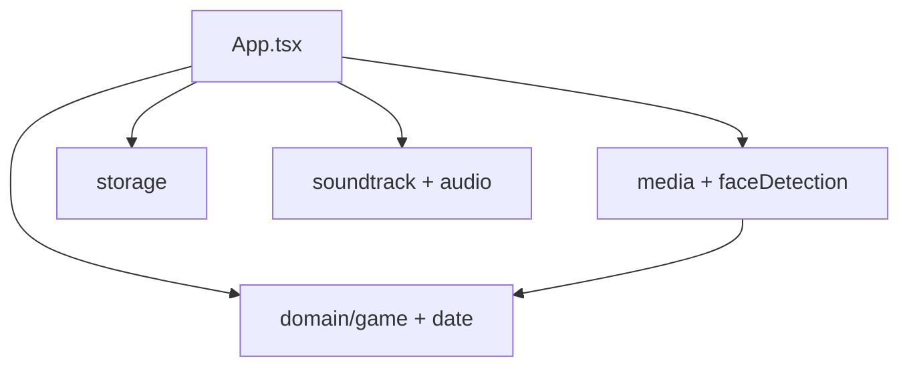

# Architecture

Keepsake is local-first. The UI coordinates a small number of seams under `apps/mobile`:

| Seam | Role |
|------|------|
| `src/domain/game.ts` | Pure round transitions, date validation, rerolls, scoring |
| `src/domain/date.ts` | Strict EXIF parsing and date formatting |
| `src/media.ts` | Android media permissions, album enumeration, metadata extraction |
| `src/faceDetection*.ts` | Platform-split face detection (native ML Kit / web stub) |
| `src/storage.ts` | Sole AsyncStorage adapter — game state, settings, album, photo index |
| `src/soundtrack/` | Live Tone.js scores on device |
| `src/components/` | Reusable presentational UI (see [Components](./components) and Storybook) |
| `App.tsx` | Screen state and presentation coordinator |

## Data flow

1. Request photo access and Android media-location access.
2. Scan the selected album locally in pages; filter metadata.
3. Validated capture dates and GPS coordinates become the local photo index.
4. A round selects several photos and persists the active game.
5. Guesses stay in memory until reveal; scoring is deterministic.

Domain and storage are extracted first because they give the highest leverage for tests and later UI refactors. Most screens still live in `App.tsx`.

